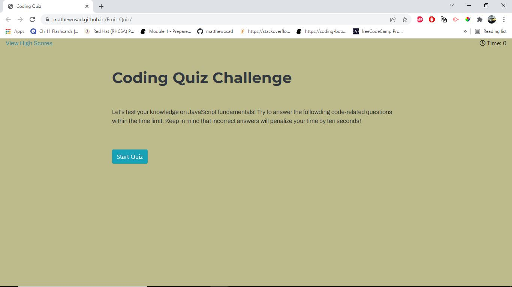

# Code Quiz

AS A coding boot camp student i was given a task to make a unique online quiz that stores high scores and i could compare my progress/result to my peers.

## Installation
1. Download or clone repository
2. Open the main page (index.html) on your browser to view webpage
3. Use a text editor to view all coding, Visual Studio Coding is recommended.
   

## Instructions
1. Click "Start Quiz"
   * Timer on the top right will start to run
   * Total time is 150 second with 12 questions in total
   * The "View High Scores" link on the top left will direct the user to view all current high scores

2. A series of questions are presented with multiple choice answers
   * If the question is answered wrong, 10 seconds will be deducted to the timer
   * If the question is answered correctly, will add 1 to the score
   * After a question is answered, it will show on the bottom whether it is answered correctly or wrong. If wrong, will also show the correct answer.
  
3. When all questions are answered or the timer reaches 0, game is over
   
4. When game is over, the user can enter initial and score, click "Submit" to save to high scores to local storage
   
5. Then it will show a list of saved high scores
   
6. The user then will have the option to click on "Go Back" to start quiz again, or "Clear High Scores" to clear saved scores

## Features
* HTML
* CSS
* JavaScript
* Bootstrap

## Sreenshot

## Websites
* Github: https://github.com/mathewosad/Code-Quiz
* Deployed: https://mathewosad.github.io/Code-Quiz/

## License
MIT
  